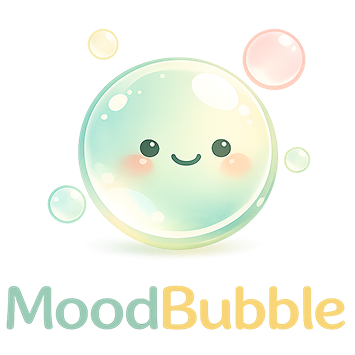

<p align="center">
  
</p>

<h1 align="center">MoodBubble</h1>

<p align="center">
  <strong>Map your emotions. Rediscover your memories.</strong><br/>
  A map-based emotional journaling platform built for UNIHACK 2026.
</p>

<p align="center">
  
  
  
  
  
</p>

---

## What is MoodBubble?

MoodBubble lets you record how you feel at specific locations and visualize your emotional landscape over time through animated bubble markers on a map. Each bubble contains a floating emoji that reflects your mood, colored with a soft gradient from calm blue to warm rose.

**Core flow:** Feel something → Drop a mood bubble → Watch your emotional map grow → Rediscover memories when you revisit places.

---

## Features

### Emotional Map
- **Animated mood bubbles** with floating emojis that drift inside colored circles
- **0-100 emotion scale** with a smooth 5-color Morandi palette (blue → mint → apricot → coral → rose)
- **Emoji mapping** — each score range gets a distinct emoji (💩 😢 😐 🙂 😊 😄 🌈)
- **Cluster bubbles** aggregate nearby moods with multiple emoji and entry count
- **Infinite scrolling map** with `worldCopyJump` — no edge of the world

### Social
- **Supabase Auth** — email/password signup and login
- **Friend system** — send/accept/reject friend requests, manage friends list
- **Friend mood sharing** — see friends' mood bubbles (dashed border, 24-hour window)
- **Emoji reactions** — react to any mood with 24 emoji options via a picker grid
- **Real-time notifications** — banner alert when friends post moods (30s polling)
- **Unread indicators** — red dots on bubbles, clusters, and mood list entries

### Memory Reminders
- **Location-triggered** — walk near a past mood location and get a reminder ("You felt 😊 here 3 months ago")
- **Anniversary-triggered** — "1 month ago today" / "3 months ago" / "1 year ago" reminders
- **Anti-spam** — max 5 per session, 5-minute cooldown, no repeats

### Mood Management
- **Create moods** with location (GPS, search, or tap-on-map), photo upload, note, category, and emotion slider
- **Edit within 10 minutes** — modify score, category, and note after posting
- **Delete with confirmation** — permanent removal with a safety dialog
- **Toggle visibility** — switch between private and shared with friends at any time
- **Client-side image compression** — progressive JPEG compression to under 200KB

### Search & Discovery
- **Global map search** — centered search panel filters all moods by note, category, or author
- **Mood list search** — in-cluster fuzzy search across notes and categories
- **Time filters** — today / this week / this month / all time
- **Access filters** — all map / private only / friends only
- **Sort controls** — newest or oldest first, with notifications pinned to top

### Profile & Insights
- **Custom avatars** — upload and crop profile photos (compressed, stored in Supabase Storage)
- **Real mood trend chart** — 7-day bar graph with actual daily averages, colored by emotion
- **Happiest day & trend detection** — computed from real data (improving / stable / declining)
- **Category breakdown** — see which activities drive your moods
- **Friend request badges** — red dots on profile button and friends section

### Polish
- **Splash screen** — MoodBubble logo while GPS locates you
- **Auto-center on GPS** — map opens at your current location
- **Bottom navigation** — Home, Add Mood, Profile with notification badges
- **Smooth animations** — slide-up modals, fade-in cards, banner transitions

---

## Tech Stack

| Layer | Technology |
|-------|-----------|
| Framework | **Next.js 16** (App Router, Turbopack) |
| Language | **TypeScript** (strict mode) |
| Styling | **Tailwind CSS v4** |
| Database | **Supabase** (PostgreSQL + Auth + Storage) |
| Map | **React Leaflet** + OpenStreetMap (CARTO light tiles) |
| Deployment | **Vercel** (auto-deploys from `main`) |

---

## Project Structure

```
src/
├── app/
│   ├── (app)/                    # Authenticated routes
│   │   ├── map/page.tsx          # Main map page (GPS, bubbles, modals)
│   │   ├── insights/page.tsx     # Profile + stats + mood trend
│   │   └── friends/page.tsx      # Friend management
│   ├── (auth)/                   # Auth routes
│   │   ├── login/page.tsx
│   │   └── signup/page.tsx
│   └── api/
│       ├── moods/                # CRUD + reactions
│       ├── friends/              # Friend requests + management
│       ├── insights/             # Stats + daily mood averages
│       ├── profile/              # Profile PATCH (name, avatar)
│       ├── users/search/         # User search for adding friends
│       └── auth/                 # Login + signup endpoints
├── components/
│   ├── MapView.tsx               # Leaflet map with emoji bubbles
│   ├── MoodDetailCard.tsx        # Centered mood preview card
│   ├── MoodDetailModal.tsx       # Full detail bottom sheet (edit/delete/react)
│   ├── ClusterDetailPanel.tsx    # Mood list with search/sort/filter
│   ├── AddMoodModal.tsx          # New mood form (slider, categories, photo)
│   ├── ReactionBar.tsx           # Emoji reaction picker + toggle
│   ├── FriendMoodBanner.tsx      # Friend notification banner + unread list
│   ├── MemoryReminderBanner.tsx  # Location/anniversary reminder banner
│   ├── UserAvatar.tsx            # Reusable avatar (image or initial)
│   ├── ProfileHeader.tsx         # Profile card + friend search
│   ├── FriendCard.tsx            # Friend list item with actions
│   ├── EditProfileModal.tsx      # Edit name + upload avatar
│   ├── BottomNav.tsx             # Tab bar with notification badge
│   └── ...
├── hooks/
│   └── useMemoryReminders.ts     # Location + anniversary reminder logic
├── utils/
│   ├── emotion-color.ts          # 5-stop Morandi color gradient (0-100)
│   ├── emotion-emoji.ts          # Score → emoji mapping
│   ├── compress-image.ts         # Progressive JPEG compression (<200KB)
│   ├── proximity.ts              # Haversine distance calculation
│   ├── geolocation.ts            # GPS position + watch utilities
│   ├── geocoding.ts              # Reverse geocoding (lat/lng → name)
│   ├── categories.ts             # Emotion category metadata
│   └── bubble-scale.ts           # Entry count → bubble size
├── lib/supabase/                 # Supabase client factories + auth
└── types/database.ts             # Full TypeScript types for all tables
```

---

## Getting Started

### Prerequisites

- Node.js >= 18
- npm
- A [Supabase](https://supabase.com) project (free tier)
- No map API key needed (uses free OpenStreetMap tiles)

### Setup

```bash
# Clone & install
git clone git@github.com:HjsCS/MoodBubble.git
cd MoodBubble
npm install

# Environment variables
vercel env pull .env.local
# Or: cp .env.example .env.local and fill in your keys

# Database setup — run in Supabase SQL Editor:
# 1. supabase/schema.sql (mood_entries table)
# 2. supabase/schema-auth.sql (profiles, friendships, RLS policies)
# 3. ALTER TABLE mood_entries ADD COLUMN reactions jsonb DEFAULT '[]';

# Supabase Storage — create bucket:
# Dashboard → Storage → New bucket → "mood-media" (public)

# Start dev server
npm run dev
```

### Environment Variables

| Variable | Side | Description |
|----------|------|-------------|
| `NEXT_PUBLIC_SUPABASE_URL` | Client | Supabase project URL |
| `NEXT_PUBLIC_SUPABASE_ANON_KEY` | Client | Supabase anonymous key |
| `SUPABASE_SERVICE_ROLE_KEY` | Server | Full-access key |

---

## API Reference

| Method | Endpoint | Description |
|--------|----------|-------------|
| `GET` | `/api/moods` | List moods (own + friends within 24h) |
| `POST` | `/api/moods` | Create a mood entry |
| `GET` | `/api/moods/:id` | Get single mood with author profile |
| `PATCH` | `/api/moods/:id` | Edit mood (10min window) / toggle reaction / change visibility |
| `DELETE` | `/api/moods/:id` | Delete own mood |
| `GET` | `/api/insights` | Profile stats + 7-day daily mood averages |
| `PATCH` | `/api/profile` | Update display name or avatar URL |
| `GET` | `/api/friends` | List accepted friends |
| `POST` | `/api/friends` | Send friend request |
| `PATCH` | `/api/friends/:id` | Accept/reject request |
| `DELETE` | `/api/friends/:id` | Remove friend or cancel request |
| `GET` | `/api/friends/requests` | Incoming + outgoing requests |
| `GET` | `/api/users/search?q=` | Search users by display name |
| `POST` | `/api/auth/login` | Email/password login |
| `POST` | `/api/auth/signup` | Create account |

### PATCH `/api/moods/:id` Modes

| Body | Behavior |
|------|----------|
| `{ toggle_reaction: "❤️" }` | Server-side toggle emoji reaction (any user) |
| `{ visibility: "friends" }` | Switch visibility (owner, no time limit) |
| `{ note, emotion_score, ... }` | Edit content (owner, within 10 minutes) |

---

## Database Schema

### `mood_entries`

| Column | Type | Notes |
|--------|------|-------|
| id | uuid (PK) | Auto-generated |
| user_id | uuid (FK) | References auth.users |
| latitude | double precision | GPS latitude |
| longitude | double precision | GPS longitude |
| emotion_score | integer | 0–100 |
| category | emotion_category | Enum (10 types) |
| note | text | Optional, max 280 chars |
| media_url | text | Supabase Storage public URL |
| visibility | visibility | 'private' or 'friends' |
| reactions | jsonb | `[{ user_id, emoji }]` |
| created_at | timestamptz | Auto-generated |

### `profiles`

| Column | Type | Notes |
|--------|------|-------|
| id | uuid (PK) | References auth.users |
| display_name | text | User's display name |
| avatar_url | text | Profile photo URL |

### `friendships`

| Column | Type | Notes |
|--------|------|-------|
| id | uuid (PK) | Auto-generated |
| requester_id | uuid (FK) | Who sent the request |
| addressee_id | uuid (FK) | Who received it |
| status | friendship_status | pending / accepted / rejected |

---

## Color System

The emotion color palette uses 5 soft Morandi-inspired stops with smooth interpolation:

| Score | Color | Hex | Feel |
|-------|-------|-----|------|
| 0 | Morandi Blue | `#94A3B8` | Subdued, calm |
| 25 | Mint Green | `#86CFAC` | Soothing |
| 50 | Warm Apricot | `#E8C87A` | Neutral, warm |
| 75 | Soft Coral | `#E8A87A` | Warm |
| 100 | Rose Pink | `#D4849A` | Intense but gentle |

---

## Deployment

Deployed on **Vercel** with auto-deploys from `main`:

1. Connect GitHub repo to Vercel
2. Add Supabase integration (auto-injects env vars)
3. Every push to `main` triggers a production deploy
4. PRs get preview deployments

---

## Team

Built with care for **UNIHACK 2026** by the Test Subjects team.

---

## License

This project was created for a hackathon. All rights reserved by the authors.
